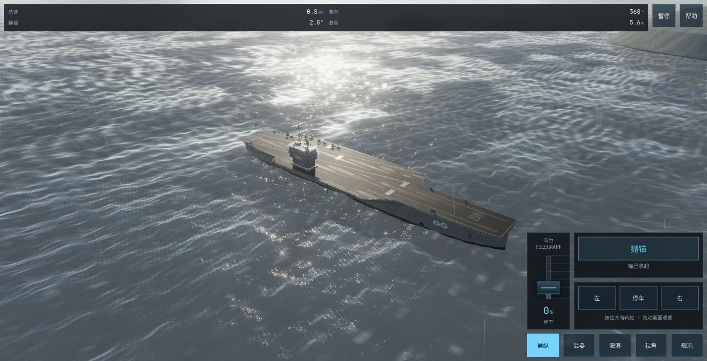

# 钢铁巨舰 · 海啸（Steel Leviathan · Tsunami）



纯前端 three.js 航母/舰船海啸生存模拟器：**零构建步骤**，一个静态服务器 + 现代浏览器即可运行。

- **11 艘舰船**：企业号 CVN-65、辽宁舰 CV-16、大和、衣阿华 BB-61、密苏里 BB-63、055 南昌舰、022 导弹快艇、Knock Nevis 超级油轮、Interceptor 48 领航艇、澳大利亚精神号竞速艇、941 台风级核潜艇
- **海况**：Gerstner 波场（CPU 物理与 GPU 渲染同一份数学）、逐面元水动力、疯狗浪 / 大型海啸 / 30 米大浪三档浪群、随机海况模式
- **人机对抗**：8 艘军舰与随机 AI 敌舰交战，快速转向、真实舰壳命中、血量与胜败结算；在线真人对战暂未开放
- **生存判定**：横摇—纵摇—甲板入水—储备浮力损失—倾覆全链路
- **武器**：主炮火光与后坐力、近防炮拦截陨石碎块、战列舰选舷全炮齐射、炮塔回旋、潜艇潜望镜
- **六视角**：环绕 / 跟随 / 舰桥 / 甲板 / 海啸 / 甲板行走第一人称（WASD 行走、E 奔跑）
- 昼夜切换、运行时画质调节器、静态几何烘焙（~900 draw call → ~40）

游戏内按 **H** 查看完整操作说明。

---

## 新电脑协作环境搭建（详细说明）

> 换一台电脑从零搭起、参与共同开发，照本节逐步执行即可。

### 前置软件

| 软件 | 版本要求 | 说明 |
|---|---|---|
| Git | ≥ 2.30 | `git --version` 验证 |
| Node.js | ≥ 20（含 npm） | 开发机实测 v26；任何 ≥20 的 LTS 均可，[nodejs.org](https://nodejs.org) 下载 |
| Python | ≥ 3.8 | macOS 自带即可；Windows 从 [python.org](https://www.python.org) 安装并勾选 "Add to PATH" |
| 浏览器 | 支持 WebGL2 | Chrome / Edge / Safari 均可 |
| Google Chrome | 仅 QA 探针需要 | 探针硬编码 macOS 路径 `/Applications/Google Chrome.app`，其他系统需改各工具开头的 `CHROME` 常量 |

### 搭建步骤

```bash
# 1. 克隆仓库（HTTPS 或 SSH 均可）
git clone https://github.com/martin-wan-1987/Game-Boat.git
cd Game-Boat

# 2. 安装依赖（three 为运行时依赖，puppeteer-core 为 QA 探针依赖）
npm install

# 3. 启动开发服务器（线程化静态服务器，端口 8765）
npm run dev

# 4. 浏览器打开
#    http://127.0.0.1:8765
```

macOS 上也可以直接双击仓库根目录的 `试玩.command`（随机端口并自动开浏览器）。

**验证装好了**：加载条走到 100% → 点「进入机库」→ 任选一艘船 →「下一步」→「启航」，能看到海面与舰船即成功。

**注意**：必须用 `tools/serve.py`，不要用 `python -m http.server`——后者单线程，强杀 headless 浏览器留下的残留连接会让下一次加载永远卡在 1%。serve.py 每请求一线程并发送 no-store 头，改完代码刷新即生效（无打包器、无热更新步骤）。

### Git 推送权限（新机器一次性配置）

二选一：

```bash
# 方式 A：GitHub CLI（推荐，之后 push 免密）
brew install gh          # 或见 https://cli.github.com
gh auth login            # 浏览器设备码授权
gh auth setup-git

# 方式 B：SSH key
ssh-keygen -t ed25519 -C "your@email.com"
cat ~/.ssh/id_ed25519.pub   # 粘贴到 GitHub → Settings → SSH keys
```

> 推送 `.github/workflows/` 下的文件需要 token 额外的 `workflow` 权限：
> `gh auth refresh -h github.com -s workflow`（同样是浏览器设备码授权，一次性）。

### 内网与外网预览

| 场景 | 地址 | 说明 |
|---|---|---|
| 本机 | `http://127.0.0.1:8765` | 开发迭代，改完刷新即生效 |
| 内网其他设备 | `http://<开发机IP>:8765` | serve.py 已绑定 0.0.0.0（开发机为无显示器 Mac mini） |
| 外网（固定域名） | `https://martin-wan-1987.github.io/Game-Boat/` | GitHub Pages 自动部署，HTTPS |

- 固定域名由 `.github/workflows/deploy.yml` 维护：push 到 main 后约 1 分钟自动
  `npm install`（解决 three 在 .gitignore 里的问题）并部署。线上只反映 main 的
  **已提交**状态，feature 分支合并回 main 后才会出现。
- 快捷试玩入口 `?play=1`（预热后直接进普通模式）两种地址都可用。
- 开发机 IP 是 DHCP 分配的，变了就用新 IP；临时 cloudflared 隧道地址不固定，仅作应急。

### 两台机器协作流程

- **开工先同步**：`git pull --rebase origin main`
- **收工必推送**：`git add -A && git commit -m "中文概括改动意图" && git push`
- 小步提交，提交信息风格与现有 git 历史一致（一句话说清做了什么、为什么）
- **改动物理 / 相机 / 海面 / 烘焙相关代码前，先读 [HANDOFF.md](HANDOFF.md) 的「必须保持的不变量」一节**——那里记录了零黑屏、海面网格跟随舰船、静态烘焙等硬性约束，违反会直接退化画质或复现黑屏 bug
- 大改动开分支（`feature/xxx`），跑过下方 QA 探针再并回 main

### 强制技能 mobile-game-ui-audit（Codex 必读）

全局 `~/.codex/AGENTS.md` 规定：手机游戏的实现前预检与交付验收必须使用 `$mobile-game-ui-audit` 技能，它是唯一验收标准。该技能已**内置在本仓库** `.codex/skills/mobile-game-ui-audit/`，新机器首次搭建时复制一次：

```bash
mkdir -p ~/.codex/skills && cp -R .codex/skills/mobile-game-ui-audit ~/.codex/skills/
```

若技能缺失，Codex 会按规则把游戏类任务标记为受阻（blocked）并拒绝声称"适配完成"——这是预期行为，不是 bug；执行上面的复制命令即可解锁。

---

## 操作说明（与游戏内 H 键帮助一致）

| 按键 | 功能 |
|---|---|
| W / S | 增减马力（前进/后退） |
| A / D | 左舵 / 右舵 |
| Shift / Ctrl | 全速前进 / 全速后退 |
| X | 停车 |
| 空格 | 抛锚等待 3 秒 / 起锚 |
| 1 / 2 / 3 | 疯狗浪 / 大型海啸 / 30 米大浪 |
| F | 主炮开火（火光、烟雾与后坐力） |
| V（长按） | 近防炮射击，自动拦截陨石碎块 |
| G | 大和、衣阿华：选舷后全炮齐射 |
| J / L（长按） | 旋转炮塔；`,` / `.` 选左/右舷 |
| T | 潜艇：升降潜望镜 |
| C | 切换视角（环绕/跟随/舰桥/甲板/海啸/甲板行走） |
| W A S D / E | 甲板行走视角：行走 / E 切换奔跑（空气墙限于甲板） |
| 鼠标拖动 / 滚轮 | 360° 环绕观察 / 拉近拉远 |
| R / M / H / P·Esc | 重置航态 / 静音 / 本说明 / 暂停 |

> 浪群会从前后左右交汇而来。迎浪时主要考验纵摇与拍击；一旦失去航速、被涌浪推成横向，就会开始剧烈横摇，大幅横摇使甲板入水、储备浮力逐渐损失，可能导致倾覆。

## 人机对抗

机库 → 模式选择 → 对抗模式 → 人机对抗 → 选择军舰 → 开始对战。
只有军舰参战；油轮、领航艇和竞速艇继续用于航行模式。敌舰随机选择，可以与玩家同型。
双方使用同一套水动力、武器和舰壳命中算法。AI 会自主航行、保持交战距离、转向规避并使用武器。
对战舵令立即响应，航向由共用物理解算器中的控制配置快速跟随；退出后恢复航行舵机。

| 武器 | 对战规则 |
|---|---|
| 普通主炮 | 自动射击，每分钟 40 发（1.5 秒间隔），每发命中 500；F / 舰炮按钮切换开关 |
| 战列舰全部主炮 | F / G / 齐射按钮请求，全主炮每 5 秒一轮；完整命中合计 2000，按炮管分配 |
| 近防炮 | 按住 V / 近防炮按钮；全舰命中总伤害 200/秒，持续 10 秒共 2000；连续 10 秒过热，冷却 5 秒；无限弹药 |
| 近防炮瞄准 | J / L 左右、I / K 上下微调；触控四向按钮与“瞄准归中”使用同一输入 |
| 导弹 | 地图面板点敌舰锁定，再按 B / 发射按钮；055 驱逐舰 20 发，每发命中 1500；锁定、射程、装填、弹药共同约束发射 |

衣阿华 BB-61、密苏里 BB-63 血量 12000，大和 13000，辽宁 14000。
首版未指定舰型采用企业号 15000、055 9000、022 6000、941 台风级 10000；
941 台风级复用 20 发导弹规则，近防炮冷却采用 5 秒。尼米兹级 15000、福特级
17000 已在规则中定义，现有舰队尚无这两类模型。

暂停和帮助冻结战斗；重置、再来一次和退出清除血量、热量、弹药、目标锁定与弹道。
固定预览地址也支持 `?play=1&mode=combat&ship=destroyer`，直接进入驱逐舰人机对抗。

规则单一来源：`src/combat-rules.js`；敌我共用算法：`src/combat.js`；
战斗读数、地图与弹道渲染：`src/combat-view.js`。

## 目录结构

```
index.html          入口：importmap（three 指向本地 node_modules）、UI 骨架、加载/机库/模式选择
src/
  main.js           装配入口（场景、游戏循环、屏幕流转）
  fleet.js          舰船注册表（机库卡片与模型同一数据源）
  ship.js           舰船装配与 bakeStatic() 静态几何烘焙
  *-layout.js       各舰船的几何定义（carrier/tanker/new-vessel/expanded-vessel）
  solid.js          闭环实体生成器（匹配平面环之间的封闭实体）
  hull-loft.js      船体放样与水线
  naval-vessels.js / expanded-vessels.js / tanker.js / submarine.js
                    各类舰船造型与行为
  waves.js          Gerstner 波场（CPU/GPU 同源数学）
  ocean.js          海面渲染；random-sea.js 随机海况调度
  tsunami.js        浪群（疯狗浪/大型海啸/30 米大浪）
  solid-water.js / vessel-water.js / water-reflection.js
                    甲板上浪、舰船水面特效（艏肩/尾流/开尔文臂）、平面反射
  physics.js        逐面元水动力与六自由度解算
  damage.js         入水—浮力损失—倾覆判定；anchor.js 抛锚
  camera.js         六相机；deck-walk.js 甲板行走投影与空气墙
  combat-rules.js / combat.js / combat-view.js
                    对战规则、敌我共用武器与命中、AI、战术地图和弹道
  weapons.js / projectiles.js / muzzle-blast.js / meteors.js
                    武器、弹道、炮口焰、陨石雨
  aircraft.js       航母甲板战机；searchlights.js 探照灯
  islands.js        岛屿地形；sky.js / atmosphere.js 天空与大气后处理
  propulsion.js     螺旋桨与推进包络；mesh-bake.js 合批工具
  ui.js / hud.js / input.js / audio.js / viewport.js / fx.js
                    机库/模式 UI、HUD、输入、音频、视口与特效
tools/
  serve.py          线程化静态服务器（npm run dev / 试玩.command 均基于它）
  play.py           双击试玩入口（随机端口）
  boot-check.mjs    能否加载（90s 超时）
  perf-probe.mjs    帧时间 / draw call / 截图（自动点击进入游戏）
  black-hunt.mjs    全视角航行逐帧黑屏审计
  physics-test.mjs  纯 Node 物理回归（吃水/横摇周期/极速/倾覆基线）
  其余 *.mjs        各专项探针（海啸、甲板、舰队、浪形导数、写实阻力等）
qa/                 QA 审计产物（按日期生成，GB 级，已 gitignore，不入库）
HANDOFF.md          开发交接文档：不变量、已知问题、调查结论（改核心逻辑前必读）
试玩.command        macOS 双击试玩
```

## 调试技巧

- 页面控制台 `window.__game` 拿到游戏实例；`__game.advance(秒)` 快进模拟（验证海啸弧线神器）
- CPU 探针用 `node tools/<名字>.mjs` 运行；对战规则用 `node tools/combat-check.mjs`，舰队物理用 `node tools/expanded-fleet-check.mjs`。
- `mobile-ui-audit.mjs`、`shader-warmup-probe.mjs` 和 `combat-browser-check.mjs` 是浏览器审计模块：在 Ego Node runtime 中导入，复用当前 TaskSpace，分别调用 `auditMobile(task, {output})`、`verifyShaders(task, {output})`、`verifyCombatBrowser(page, {output})`。手机截图必须实际目视检查后再调用 `finalizeMobileAudit(output, {reviewedShots, notes})`；仅运行模块文件不会产生完整审核。
- headless Chrome 残留进程会抢 CPU 让一切超时：`pkill -f "Google Chrome.*headless"`（**绝不能** `pkill -f "Google Chrome"`，会杀掉正常浏览器）

## 已知问题

- 大型海啸召唤瞬间偶发**整屏黑**（着色器同步编译卡顿）：调查结论与修复路径见 [HANDOFF.md](HANDOFF.md)，已交接后续开发
- 手机端布局审计报告在本地 `qa/` 目录（不入库），运行方法见上方浏览器审计模块说明；真机 iOS/Android 安全区域读取仍需单独验证。
